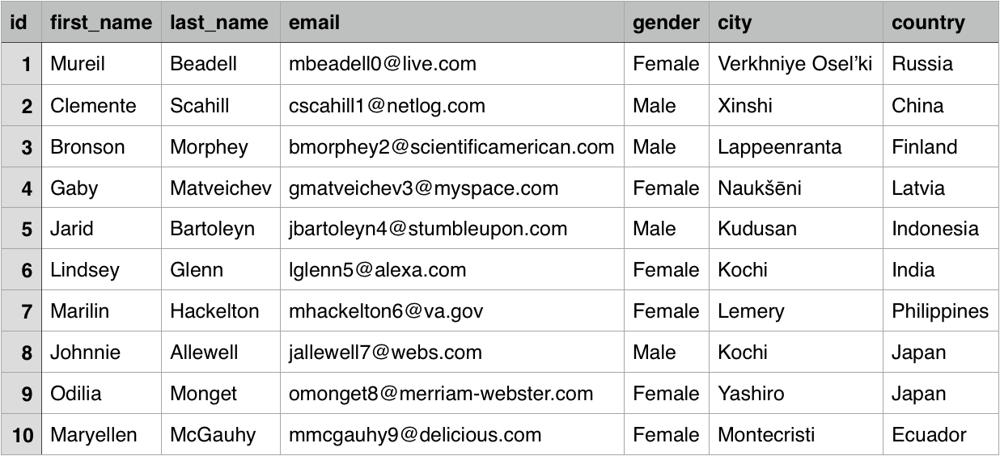

# Csv - Search
Search large csv files with lucene.

## Input sample csv file


## Prerequisites
- Lucene raw query language

## Build the jar
`gradle shadowJar`

## 1. Simple Search
`java -jar ./build/libs/csvsearch.jar employee-details.csv "country:japan AND city:kochi"`

```csv
8,Johnnie,Allewell,jallewell7@webs.com,Male,Kochi,Japan
```


## 2. Search With Filtered Fields
`java -jar ./build/libs/csvsearch.jar employee-details.csv "country:japan" id,first_name`

```csv
8,Johnnie
9,Odilia
```

## Features
- Scalable, can index csv with millions of rows.
- Full lucene query support.

## Links
- Lucene Query Syntax http://www.lucenetutorial.com/lucene-query-syntax.html
